

  <picture>
    <source media="(max-width: 600px) and (prefers-color-scheme: dark)" srcset="assets/hero-mobile.svg" />
  <source media="(max-width: 600px)" srcset="assets/hero-mobile-light.svg" />
  <source media="(prefers-color-scheme: dark)" srcset="assets/hero.svg" />
    <source media="(prefers-color-scheme: light)" srcset="assets/hero-light.svg" />
    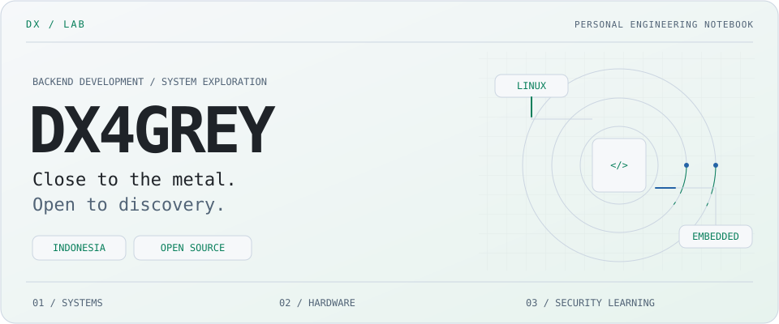
  </picture>

  <picture>
    <source media="(max-width: 600px) and (prefers-color-scheme: dark)" srcset="assets/roles-mobile.svg" />
  <source media="(max-width: 600px)" srcset="assets/roles-mobile-light.svg" />
  <source media="(prefers-color-scheme: dark)" srcset="assets/roles.svg" />
    <source media="(prefers-color-scheme: light)" srcset="assets/roles-light.svg" />
    
  </picture>

  <a href="https://github.com/DX4GREY">
    <picture>
      <source media="(prefers-color-scheme: dark)" srcset="assets/profile.svg" />
      <source media="(prefers-color-scheme: light)" srcset="assets/profile-light.svg" />
      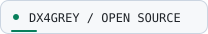
    </picture>
  </a>
  <a href="https://github.com/DX4GREY?tab=followers">
    <picture>
      <source media="(prefers-color-scheme: dark)" srcset="assets/followers.svg" />
      <source media="(prefers-color-scheme: light)" srcset="assets/followers-light.svg" />
      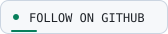
    </picture>
  </a>

  <a href="#whoami">About</a> ·
  <a href="#featured-projects">Projects</a> ·
  <a href="#tech-stack">Stack</a> ·
  <a href="#github-activity">Activity</a> ·
  <a href="#connect">Connect</a>

<picture>
  <source media="(prefers-color-scheme: dark)" srcset="assets/signal.svg" />
  <source media="(prefers-color-scheme: light)" srcset="assets/signal-light.svg" />
  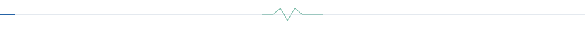
</picture>

## `whoami`

**Backend developer from Indonesia.** I explore the space between
systems software, embedded hardware, and responsible security research.

Linux internals · C++ tooling · ESP32 experiments · Open-source software

I enjoy exploring how things work under the hood, from Linux processes and
low-level tooling to embedded hardware and open-source software. I build,
document, test, and share projects that are useful in the real world.

  <picture>
    <source media="(max-width: 600px) and (prefers-color-scheme: dark)" srcset="assets/terminal-mobile.svg" />
  <source media="(max-width: 600px)" srcset="assets/terminal-mobile-light.svg" />
  <source media="(prefers-color-scheme: dark)" srcset="assets/terminal.svg" />
    <source media="(prefers-color-scheme: light)" srcset="assets/terminal-light.svg" />
    
  </picture>

## Areas of exploration

<picture>
  <source media="(prefers-color-scheme: dark)" srcset="assets/focus-systems.svg" />
  <source media="(prefers-color-scheme: light)" srcset="assets/focus-systems-light.svg" />
  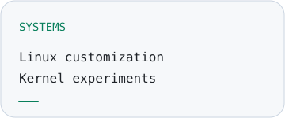
</picture>
<picture>
  <source media="(prefers-color-scheme: dark)" srcset="assets/focus-embedded.svg" />
  <source media="(prefers-color-scheme: light)" srcset="assets/focus-embedded-light.svg" />
  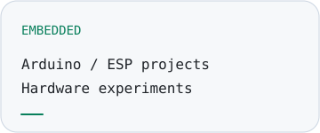
</picture>
<picture>
  <source media="(prefers-color-scheme: dark)" srcset="assets/focus-security.svg" />
  <source media="(prefers-color-scheme: light)" srcset="assets/focus-security-light.svg" />
  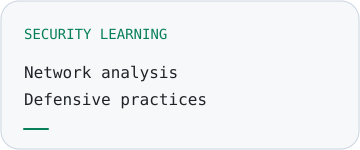
</picture>

## Featured projects

<a href="https://github.com/DX4GREY/nizaw">
  <picture>
    <source media="(prefers-color-scheme: dark)" srcset="assets/project-nizaw.svg" />
    <source media="(prefers-color-scheme: light)" srcset="assets/project-nizaw-light.svg" />
    
  </picture>
</a>
<h3><a href="https://github.com/DX4GREY/nizaw">Nizaw</a></h3>

Linux system and CLI framework written in C++20.

  <picture>
    <source media="(prefers-color-scheme: dark)" srcset="assets/cpp.svg" />
    <source media="(prefers-color-scheme: light)" srcset="assets/cpp-light.svg" />
    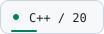
  </picture>
  <picture>
    <source media="(prefers-color-scheme: dark)" srcset="assets/linux.svg" />
    <source media="(prefers-color-scheme: light)" srcset="assets/linux-light.svg" />
    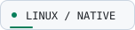
  </picture>

<a href="https://github.com/DX4GREY/esp32_rfsuite">
  <picture>
    <source media="(prefers-color-scheme: dark)" srcset="assets/project-rf.svg" />
    <source media="(prefers-color-scheme: light)" srcset="assets/project-rf-light.svg" />
    
  </picture>
</a>
<h3><a href="https://github.com/DX4GREY/esp32_rfsuite">ESP32 RF Suite</a></h3>

2.4 GHz RF analyzer built around an ESP32-S3 and two nRF24L01+ radios. Features include spectrum scanning, waterfall visualization, channel inspection, event detection, logging, and live hardware diagnostics.

  <picture>
    <source media="(prefers-color-scheme: dark)" srcset="assets/esp32.svg" />
    <source media="(prefers-color-scheme: light)" srcset="assets/esp32-light.svg" />
    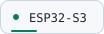
  </picture>
  <picture>
    <source media="(prefers-color-scheme: dark)" srcset="assets/embedded.svg" />
    <source media="(prefers-color-scheme: light)" srcset="assets/embedded-light.svg" />
    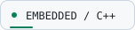
  </picture>

## Tech stack

Technologies documented in the public profile and featured project descriptions.

<picture>
  <source media="(prefers-color-scheme: dark)" srcset="assets/tech-cpp.svg" />
  <source media="(prefers-color-scheme: light)" srcset="assets/tech-cpp-light.svg" />
  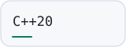
</picture>
<picture>
  <source media="(prefers-color-scheme: dark)" srcset="assets/tech-linux.svg" />
  <source media="(prefers-color-scheme: light)" srcset="assets/tech-linux-light.svg" />
  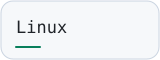
</picture>
<picture>
  <source media="(prefers-color-scheme: dark)" srcset="assets/tech-esp32.svg" />
  <source media="(prefers-color-scheme: light)" srcset="assets/tech-esp32-light.svg" />
  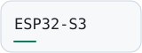
</picture>
<picture>
  <source media="(prefers-color-scheme: dark)" srcset="assets/tech-nrf.svg" />
  <source media="(prefers-color-scheme: light)" srcset="assets/tech-nrf-light.svg" />
  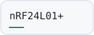
</picture>
<picture>
  <source media="(prefers-color-scheme: dark)" srcset="assets/tech-arduino.svg" />
  <source media="(prefers-color-scheme: light)" srcset="assets/tech-arduino-light.svg" />
  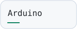
</picture>

## GitHub activity

Explore my [repositories](https://github.com/DX4GREY?tab=repositories) and
[contribution history](https://github.com/DX4GREY?tab=overview) on GitHub.

### Code playground

  <picture>
    <source media="(max-width: 600px) and (prefers-color-scheme: dark)" srcset="assets/playground-mobile.svg" />
  <source media="(max-width: 600px)" srcset="assets/playground-mobile-light.svg" />
  <source media="(prefers-color-scheme: dark)" srcset="assets/playground.svg" />
    <source media="(prefers-color-scheme: light)" srcset="assets/playground-light.svg" />
    
  </picture>

<picture>
  <source media="(prefers-color-scheme: dark)" srcset="assets/signal.svg" />
  <source media="(prefers-color-scheme: light)" srcset="assets/signal-light.svg" />
  
</picture>

## Support open source

Explore the projects, read their documentation, and share reproducible feedback
through the relevant repository's issue tracker.

Information sources

Profile details and project descriptions were checked against the
[public GitHub profile](https://github.com/DX4GREY), including its pinned
[Nizaw](https://github.com/DX4GREY/nizaw) and
[ESP32 RF Suite](https://github.com/DX4GREY/esp32_rfsuite) descriptions.
The animated terminal and code playground are illustrations, not live telemetry.

## Connect

  <a href="https://github.com/DX4GREY">
    <picture>
      <source media="(prefers-color-scheme: dark)" srcset="assets/github.svg" />
      <source media="(prefers-color-scheme: light)" srcset="assets/github-light.svg" />
      
    </picture>
  </a>
  <a href="https://github.com/DX4GREY?tab=repositories">
    <picture>
      <source media="(prefers-color-scheme: dark)" srcset="assets/repositories.svg" />
      <source media="(prefers-color-scheme: light)" srcset="assets/repositories-light.svg" />
      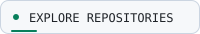
    </picture>
  </a>

  <picture>
    <source media="(max-width: 600px) and (prefers-color-scheme: dark)" srcset="assets/footer-mobile.svg" />
  <source media="(max-width: 600px)" srcset="assets/footer-mobile-light.svg" />
  <source media="(prefers-color-scheme: dark)" srcset="assets/footer.svg" />
    <source media="(prefers-color-scheme: light)" srcset="assets/footer-light.svg" />
    
  </picture>

