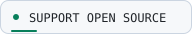
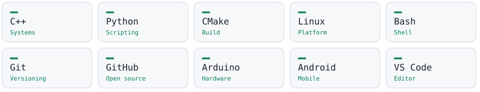
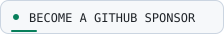

  <picture>
    <source media="(prefers-color-scheme: dark)" srcset="assets/hero.svg" />
    <source media="(prefers-color-scheme: light)" srcset="assets/hero-light.svg" />
    
  </picture>

  <picture>
    <source media="(prefers-color-scheme: dark)" srcset="assets/roles.svg" />
    <source media="(prefers-color-scheme: light)" srcset="assets/roles-light.svg" />
    
  </picture>

  <a href="https://github.com/DX4GREY">
    <picture>
      <source media="(prefers-color-scheme: dark)" srcset="assets/profile.svg" />
      <source media="(prefers-color-scheme: light)" srcset="assets/profile-light.svg" />
      
    </picture>
  </a>
  <a href="https://github.com/DX4GREY?tab=followers">
    <picture>
      <source media="(prefers-color-scheme: dark)" srcset="assets/followers.svg" />
      <source media="(prefers-color-scheme: light)" srcset="assets/followers-light.svg" />
      
    </picture>
  </a>
  <a href="https://github.com/sponsors/DX4GREY">
    <picture>
      <source media="(prefers-color-scheme: dark)" srcset="assets/sponsor.svg" />
      <source media="(prefers-color-scheme: light)" srcset="assets/sponsor-light.svg" />
      
    </picture>
  </a>

  <a href="#whoami">About</a> ·
  <a href="#featured-projects">Projects</a> ·
  <a href="#tech-stack">Stack</a> ·
  <a href="#github-activity">Activity</a> ·
  <a href="#connect">Connect</a>

<picture>
  <source media="(prefers-color-scheme: dark)" srcset="assets/signal.svg" />
  <source media="(prefers-color-scheme: light)" srcset="assets/signal-light.svg" />
  
</picture>

## `whoami`

**Software developer based in Indonesia.** I explore the space between
systems software, embedded hardware, and responsible security research.

Linux internals · C++ tooling · ESP32 experiments · Open-source software

I enjoy exploring how things work under the hood, from Linux processes and
low-level tooling to embedded hardware and open-source software. I build,
document, test, and share projects that are useful in the real world.

  <picture>
    <source media="(prefers-color-scheme: dark)" srcset="assets/terminal.svg" />
    <source media="(prefers-color-scheme: light)" srcset="assets/terminal-light.svg" />
    
  </picture>

## Featured projects

<table>
  <tr>
    <td width="50%" valign="top">
      <a href="https://github.com/DX4GREY/nizaw">
        <picture>
          <source media="(prefers-color-scheme: dark)" srcset="assets/project-nizaw.svg" />
          <source media="(prefers-color-scheme: light)" srcset="assets/project-nizaw-light.svg" />
          
        </picture>
      </a>
      <h3><a href="https://github.com/DX4GREY/nizaw">Nizaw</a></h3>
      
Read-only Linux system inspection framework for understanding processes, system state, and runtime information.

      

        <picture>
          <source media="(prefers-color-scheme: dark)" srcset="assets/cpp.svg" />
          <source media="(prefers-color-scheme: light)" srcset="assets/cpp-light.svg" />
          
        </picture>
        <picture>
          <source media="(prefers-color-scheme: dark)" srcset="assets/linux.svg" />
          <source media="(prefers-color-scheme: light)" srcset="assets/linux-light.svg" />
          
        </picture>
      

    </td>
    <td width="50%" valign="top">
      <a href="https://github.com/DX4GREY/esp32_rfsuite">
        <picture>
          <source media="(prefers-color-scheme: dark)" srcset="assets/project-rf.svg" />
          <source media="(prefers-color-scheme: light)" srcset="assets/project-rf-light.svg" />
          
        </picture>
      </a>
      <h3><a href="https://github.com/DX4GREY/esp32_rfsuite">ESP32 RF Suite</a></h3>
      
ESP32-S3 toolkit for legal 2.4 GHz radio monitoring, channel analysis, and embedded experimentation.

      

        <picture>
          <source media="(prefers-color-scheme: dark)" srcset="assets/esp32.svg" />
          <source media="(prefers-color-scheme: light)" srcset="assets/esp32-light.svg" />
          
        </picture>
        <picture>
          <source media="(prefers-color-scheme: dark)" srcset="assets/embedded.svg" />
          <source media="(prefers-color-scheme: light)" srcset="assets/embedded-light.svg" />
          
        </picture>
      

    </td>
  </tr>
</table>

## Tech stack

  <picture>
    <source media="(prefers-color-scheme: dark)" srcset="assets/tech-stack.svg" />
    <source media="(prefers-color-scheme: light)" srcset="assets/tech-stack-light.svg" />
    
  </picture>

## GitHub activity

Explore my [repositories](https://github.com/DX4GREY?tab=repositories) and
[contribution history](https://github.com/DX4GREY?tab=overview) on GitHub.

### Code playground

  <picture>
    <source media="(prefers-color-scheme: dark)" srcset="assets/playground.svg" />
    <source media="(prefers-color-scheme: light)" srcset="assets/playground-light.svg" />
    
  </picture>

<picture>
  <source media="(prefers-color-scheme: dark)" srcset="assets/signal.svg" />
  <source media="(prefers-color-scheme: light)" srcset="assets/signal-light.svg" />
  
</picture>

## Support open source

If my projects help you, consider supporting their development. Your support
helps fund testing, documentation, hardware experiments, and future releases.

  <a href="https://github.com/sponsors/DX4GREY">
    <picture>
      <source media="(prefers-color-scheme: dark)" srcset="assets/support.svg" />
      <source media="(prefers-color-scheme: light)" srcset="assets/support-light.svg" />
      
    </picture>
  </a>

## Connect

  <a href="https://github.com/DX4GREY">
    <picture>
      <source media="(prefers-color-scheme: dark)" srcset="assets/github.svg" />
      <source media="(prefers-color-scheme: light)" srcset="assets/github-light.svg" />
      
    </picture>
  </a>
  <a href="https://github.com/DX4GREY?tab=repositories">
    <picture>
      <source media="(prefers-color-scheme: dark)" srcset="assets/repositories.svg" />
      <source media="(prefers-color-scheme: light)" srcset="assets/repositories-light.svg" />
      
    </picture>
  </a>

  <picture>
    <source media="(prefers-color-scheme: dark)" srcset="assets/footer.svg" />
    <source media="(prefers-color-scheme: light)" srcset="assets/footer-light.svg" />
    
  </picture>

